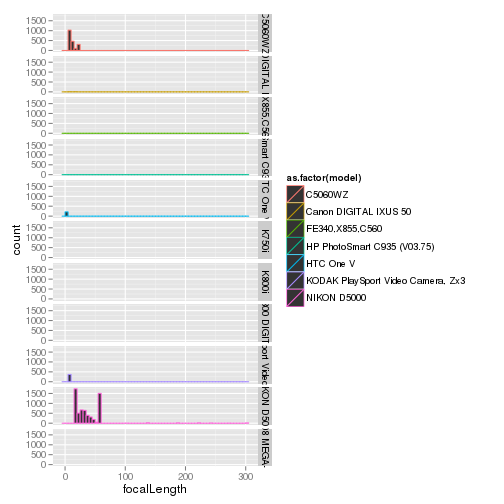

DigikamR
========================================================

This script shows how to use R to pull data out of the database for the open-source photo management application Digikam


```r

library(RSQLite)
```

```
## Loading required package: DBI
```

```r
library(ggplot2)
library(plyr)

m <- dbDriver("SQLite")
basedir <- "/home/paul/RStudio/DigikamR/"
con <- dbConnect(m, dbname = paste(basedir, "data/digikam4.db", sep = ""))

# List the tables in the database
dbListTables(con)
```

```
##  [1] "AlbumRoots"         "Albums"             "DownloadHistory"   
##  [4] "ImageComments"      "ImageCopyright"     "ImageHaarMatrix"   
##  [7] "ImageHistory"       "ImageInformation"   "ImageMetadata"     
## [10] "ImagePositions"     "ImageProperties"    "ImageRelations"    
## [13] "ImageTagProperties" "ImageTags"          "Images"            
## [16] "Searches"           "Settings"           "TagProperties"     
## [19] "Tags"               "TagsTree"
```

```r

# List the columns of some of the interesting tables
names(dbReadTable(con, "ImageInformation"))
```

```
##  [1] "imageid"          "rating"           "creationDate"    
##  [4] "digitizationDate" "orientation"      "width"           
##  [7] "height"           "format"           "colorDepth"      
## [10] "colorModel"
```

```r
names(dbReadTable(con, "ImageComments"))
```

```
## [1] "id"       "imageid"  "type"     "language" "author"   "date"    
## [7] "comment"
```

```r
names(dbReadTable(con, "ImageMetadata"))
```

```
##  [1] "imageid"                      "make"                        
##  [3] "model"                        "lens"                        
##  [5] "aperture"                     "focalLength"                 
##  [7] "focalLength35"                "exposureTime"                
##  [9] "exposureProgram"              "exposureMode"                
## [11] "sensitivity"                  "flash"                       
## [13] "whiteBalance"                 "whiteBalanceColorTemperature"
## [15] "meteringMode"                 "subjectDistance"             
## [17] "subjectDistanceCategory"
```

```r
names(dbReadTable(con, "ImageProperties"))
```

```
## [1] "imageid"  "property" "value"
```

```r
names(dbReadTable(con, "ImagePositions"))
```

```
##  [1] "imageid"         "latitude"        "latitudeNumber" 
##  [4] "longitude"       "longitudeNumber" "altitude"       
##  [7] "orientation"     "tilt"            "roll"           
## [10] "accuracy"        "description"
```

```r
names(dbReadTable(con, "Images"))
```

```
## [1] "id"               "album"            "name"            
## [4] "status"           "category"         "modificationDate"
## [7] "fileSize"         "uniqueHash"
```

```r
names(dbReadTable(con, "TagProperties"))
```

```
## [1] "tagid"    "property" "value"
```

```r
names(dbReadTable(con, "Settings"))
```

```
## [1] "keyword" "value"
```

```r

# Pull some of the information together
Imgs <- dbReadTable(con, "Images")
ImgComments <- dbReadTable(con, "ImageComments")
ImgMeta <- dbReadTable(con, "ImageMetadata")
ImgInfo <- dbReadTable(con, "ImageInformation")

# and merge it together
ImgMerge <- merge(Imgs, ImgMeta, by.x = "id", by.y = "imageid")
ImgMerge <- merge(ImgMerge, ImgInfo, by.x = "id", by.y = "imageid")

# clean it up
ImgMerge$make <- as.factor(ImgMerge$make)
ImgMerge$model <- as.factor(ImgMerge$model)

ImgMerge$faperture <- as.factor(ImgMerge$aperture)
ImgMerge$fexposureTime <- as.factor(ImgMerge$exposureTime)
ImgMerge$fmodel <- as.factor(ImgMerge$model)

ImgMerge$Year <- format(as.POSIXct(ImgMerge$creationDate), format = "%Y")
ImgMerge$Month <- format(as.POSIXct(ImgMerge$creationDate), format = "%b")
```


Here are some plots


```r
# and draw some graphs
ggplot(data = subset(ImgMerge, focalLength < 60), aes(x = as.POSIXct(creationDate), 
    y = focalLength, colour = model)) + geom_point()
```

 

```r

ggplot(data = ImgMerge, aes(x = focalLength)) + geom_histogram(binwidth = 5, 
    aes(colour = as.factor(model))) + facet_grid(model ~ .)
```

 

```r

qplot(data = ImgMerge, x = as.numeric(as.character(aperture)), y = log(as.numeric(as.character(exposureTime))), 
    colour = as.factor(model), geom = "point")
```

```
## Warning: Removed 2638 rows containing missing values (geom_point).
```

 

```r

ggplot(data = subset(ImgMerge, model == "NIKON D5000"), aes(x = focalLength)) + 
    geom_histogram(binwidth = 5) + facet_grid(Year ~ .)
```

 

```r

ggplot(data = subset(ImgMerge, model == "NIKON D5000"), aes(x = as.POSIXct(creationDate), 
    y = focalLength)) + geom_point()
```

```
## Warning: Removed 14 rows containing missing values (geom_point).
```

 

```r

ggplot(data = subset(ImgMerge, model == "NIKON D5000" & focalLength < 60), aes(x = as.POSIXct(creationDate), 
    y = focalLength)) + geom_point(alpha = 0.2)
```

 


